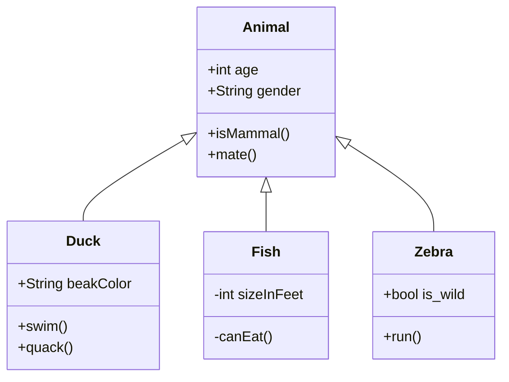

# repo20260212
GH-900講義デモ用!!




## 概要

FastAPIを使用した「現在時刻(UTC)」を出力するシンプルなAPIサンプルプロジェクトです。

## プロジェクト構成

```
.
├── src/
│   └── main.py         # FastAPIアプリケーションのメインファイル
├── tests/
│   └── test_main.py    # pytestによる単体テスト
├── requirements.txt    # 必要なパッケージ一覧
└── README.md           # このファイル
```

## セットアップ

### 1. 必要なパッケージのインストール

```bash
pip install -r requirements.txt
```

## 使い方

### アプリケーションの起動

```bash
uvicorn src.main:app --reload
```

アプリケーションが起動したら、ブラウザで http://127.0.0.1:8000 にアクセスしてください。

### APIドキュメント

FastAPIの自動生成されたAPIドキュメントは以下のURLで確認できます：

- Swagger UI: http://127.0.0.1:8000/docs
- ReDoc: http://127.0.0.1:8000/redoc

## テスト

### 単体テストの実行

```bash
pytest
```

または、詳細な出力を表示する場合：

```bash
pytest -v
```

## APIエンドポイント

### GET /

現在時刻(UTC)をISO 8601形式で返します。

**レスポンス例：**
```json
{
  "current_time": "2026-02-12T12:34:56.789012Z"
}
```

## 必要なパッケージ

- **fastapi**: モダンで高速なWebフレームワーク
- **uvicorn**: ASGI サーバー
- **pytest**: テスティングフレームワーク
- **httpx**: pytestでのHTTPクライアント（TestClient用）
